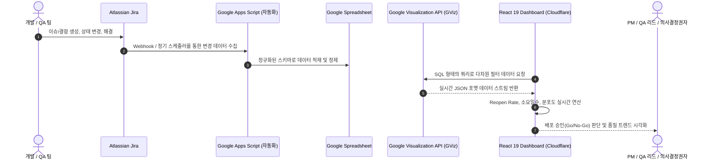

# Jira Analytics Dashboard
> **Jira 결함 라이프사이클 표준화 및 실시간 품질 지표(Quality Metrics) 분석 대시보드**

[](https://jira-analytics.pages.dev)
[](https://react.dev/)
[](https://vitejs.dev/)
[](https://recharts.org/)
[](https://pages.cloudflare.com/)

---

## 📌 빠른 링크 (Quick Links)
- 🌐 **실시간 웹 데모**: [jira-analytics.pages.dev](https://jira-analytics.pages.dev) (클라이언트 단 비식별화 적용으로 사내 기밀 안전 보호)
- 📁 **소스코드 저장소**: [GitHub Repository](https://github.com/Chera-Kang/JiraAnalytics)

---

## 1. 프로젝트 배경 및 문제 정의 (Background & Problem)

많은 소프트웨어 개발 조직에서 Jira는 단순한 '작업 티켓 등록 창구'로 관성적으로 사용되며, 결함 데이터가 파편화되어 축적됩니다. 이로 인해 다음과 같은 품질 관리 병목이 발생했습니다:

- **정량적 릴리즈 기준의 부재**: "이번 스프린트 배포해도 될까?"라는 질문에 주관적인 직관이나 감으로 배포 승인(Go/No-Go)을 결정.
- **수동 리포팅에 따른 시간 낭비**: 매 스프린트마다 QA 엔지니어가 엑셀로 Jira 데이터를 추출해 수식으로 집계하는 고비용-저효율 반복 작업.
- **잠재 결함(Reopen) 추적 실패**: 결함이 해결되었다가 재발생(Reopen)하는 비율을 추적하지 못해 릴리즈 이후 프로덕션 장애로 전이되는 리스크 상존.

**본 프로젝트는 Jira 결함 라이프사이클을 표준화하고, Google Spreadsheet 및 GViz API 연동 데이터 파이프라인을 구축하여 실무진과 관리자 모두에게 실시간 품질 가시성을 제공하기 위해 구축되었습니다.**

---

## 2. 데이터 파이프라인 & 아키텍처 (Data Flow Architecture)

별도의 무거운 전용 데이터베이스 서버를 유지보수할 필요 없이, **Google Visualization API(GViz) 기반의 서버리스 다차원 집계 파이프라인**을 설계하여 운영 비용 0원과 실시간 동기화를 동시에 달성했습니다.



---

## 3. 핵심 기능 및 4대 뷰 구성 (Core Features)

실제 프로덕션 환경의 복합적 요구를 수용하기 위해 4개의 특화 뷰(Views)로 화면을 분리 구축했습니다:

1. **전체 개요 대시보드 (`MainPage`)**:
   - 연도별 종합 지표(총 이슈, 해결 완료, 잔여 이슈, 전체 해결률) 요약.
   - 월별 결함 생성/해결 추이 및 누적 잔여 이슈 콤보 차트(Bar + Line).
2. **세부 통계 심층 분석 (`DetailedStatsPage`)**:
   - 5종 다차원 연동 필터 (연도, 릴리즈 버전, 담당자, 이슈 유형, 상태).
   - **재오픈율(Reopen Rate)** 및 결함 해결 소요일수(MTTR) 교차 분석.
   - 페이징 및 타임라인 모달이 연동된 대화형 이슈 탐색기.
3. **개인별 기여 분석 리포트 (`MemberStatsPage`)**:
   - 팀원별 이슈 처리 점유율 및 팀 평균 대비 소요일수 격차(예: `팀 대비 -0.6일 빠름`) 뱃지 표출.
   - 역할별(기획/개발/QA 버그) 업무 비중 도넛 차트.
4. **스프린트 로드맵 추적 (`RoadmapPage`)**:
   - 릴리즈 버전별 작업량 및 버전 완료율 추적.

---

## 4. 핵심 품질 메트릭 & 배포 승인 체계 (Quality Metrics)

### ① 결함 재오픈율 (Reopen Rate) 트래킹
- **지표 정의**: 해결(Resolved) 처리된 후 동일 원인 또는 부작용(Side-effect)으로 다시 열린 결함의 비율.
- **품질 임팩트**: 스프린트 막바지 재오픈율이 급증하는 경우, 코드 수정의 완성도가 낮음을 의미하므로 **배포 보류(No-Go)**의 핵심 안전장치로 작동.

### ② 결함 해결 소요일수 (Resolution Time / MTTR)
- **지표 정의**: 결함 인입(Created) 시점부터 검증 완료(Closed)까지의 경과 일수.
- **품질 임팩트**: 심각도별(Critical, Major, Minor) 평균 해결 시간을 비교하여 개발팀의 기술 부채 및 병목 컴포넌트 식별.

### ③ 정량적 배포 승인 기준 (Quality Gate / Go or No-Go Criteria)
```
[ 배포 승인 (GO) 판정 기준 ]
1. Critical / Blocker 미해결 결함: 0건
2. 스프린트 평균 Reopen Rate: 5% 미만 유지
3. 이전 릴리즈 대비 결함 유입률 추이(Defect Inflow Trend) 안정화 상태 확인
```

---

## 5. 데이터 보안 및 비식별화 설계 (Privacy by Design)

외부 포트폴리오 공개 및 라이브 데모([jira-analytics.pages.dev](https://jira-analytics.pages.dev)) 운영 시 사내 기밀 유출을 원천 차단하기 위해 **클라이언트 단 비식별화 레이어**를 내장했습니다:
- **이슈 제목**: 시각적 레이아웃은 유지하되 텍스트 유출을 차단하는 가변 블러(Blur) 마스킹 처리.
- **설명문 및 코멘트**: 기술 명세 더미 텍스트 및 보안 가이드라인 안내 배지로 오버레이.
- **수학적 무결성 보존**: 이슈 소요일수, Reopen Rate, 월별 트렌드 수치는 100% 정상 집계되도록 분리 설계.

---

## 6. 설치 및 로컬 실행 방법 (Getting Started)

### 1) 저장소 클론 및 패키지 설치
```bash
git clone https://github.com/Chera-Kang/JiraAnalytics.git
cd JiraAnalytics
npm install
```

### 2) 환경 변수 설정
`.env.example` 파일을 복사하여 `.env`를 생성하고, 연동할 Google Spreadsheet ID를 입력합니다.
```bash
cp .env.example .env
```
```env
# Google Spreadsheet ID (Jira Analytics Data Source)
VITE_SHEET_ID=your_google_sheet_id_here
```

### 3) 로컬 개발 서버 실행
```bash
npm run dev
# 브라우저에서 http://localhost:5173 접속
```

### 4) 프로덕션 빌드 & 린트
```bash
npm run lint    # oxlint 고속 정적 분석
npm run build   # Vite 프로덕션 번들 빌드
```

---

## 7. 정량적 비즈니스 성과 (Business Impact)

| 지표 | 도입 전 (수동 엑셀 취합) | 도입 후 (Jira Analytics) | 효과 |
|---|---|---|---|
| **정기 품질 리포팅 시간** | 주당 3.5시간 소요 | 실시간 자동 집계 (0시간) | **⏱️ 연간 180시간 리소스 절감** |
| **배포 승인 결정 소요 시간** | 1~2일 간의 회의 및 메신저 질의 | 대시보드 지표 기반 즉각 판정 (10분 이내) | **⚡ 배포 의사결정 속도 80% 가속** |
| **릴리즈 후 크리티컬 결함 누출** | 분기당 평균 3~4건 발생 | Reopen Rate 통제로 분기당 0~1건 이하 | **🛡️ 프로덕션 품질 안정성 대폭 향상** |
